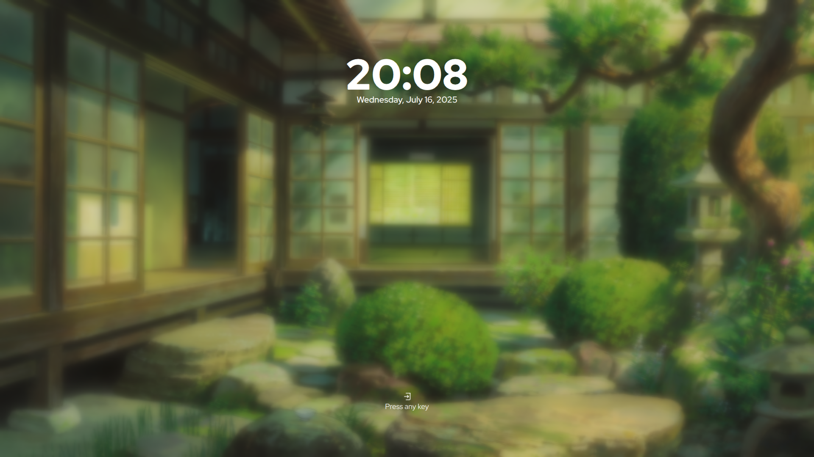

<div align="center">
    <h1>Sddm-Themes(just stored btw)</h1>
</div>

# Themes Show



# Installations


```
sudo bash ./install.sh
```

# Usage
- Change avatar themes: " ./change_avatar.sh 'username' 'path to image' "
